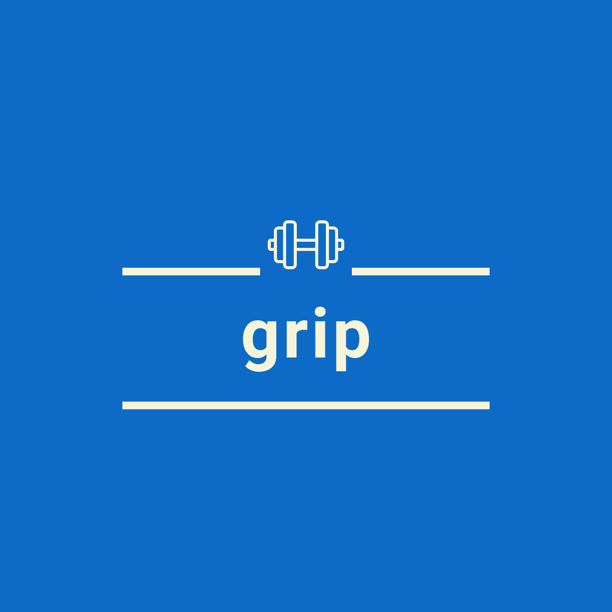

# Grip App 

 

# Overview

Grip is a Fullstack application that allows personal trainers to track their clients and their progress.  It includes user authentication using passport.js and bcrypt, data persistence using MongoDB, data retrieval via Mongoose, Front-end UI/UX using React Native, graphs assembled using React Native Chart Kit, and finally utilizes an Express server built with Node.js.  

## Getting Started

1.  [Using Grip](#using-grip)
2.  [User Authentication](#user-authentication)
3.  [Database](#database)
4.  [Navigation](#navigation)
5.  [Graphs](#graphs)
6.  [Next Steps](#next-steps)
7.  [Arichtecture](#architecture)
8.  [Credits and Collaborations](#credits-and-collaborations)

## Using Grip

To use grip you must....  Is it deployed to heroku?  Do we have a link?  Or should we instruct users to download expo, then run npm start in their terminal and scan QIR Code?

## User Authentication

Enter user auth info here.

## Database

Enter database info here.

## Navigation

Enter navigation info here.

## Graphs

Our graphs were created using React-Native-Chart-Kit.  This is an npm packagage and we utilize both line and progress graphs. These graphs have functionality with expo, which we are utilzing to display our our application. Documenation for React-Native-Chart-Kit can be found here: https://www.npmjs.com/package/react-native-chart-kit

## Next Steps

Enter next steps info here.

## Architecture

This application was deployed with the following technologies:

Node.js, JavaScript, React Native, MongoDB, React Navigation, Express, React Native Chart Kit, Expo, Heroku, Bcrypt, and Passport.js

## Credits and Collaborations

Collaborators: [Colin McPike](https://github.com/therealmcp) , [Derek Rutter](https://github.com/rutterer) , [Mona Rahmani ](https://github.com/monarahmani) , [Michael Lee](https://github.com/PurpleBunBunny) , [Jared Yslas](https://github.com/YslasCo)

Speical thanks to the Full Stack Flex UW Coding Bootcamp instructional staff who assisted us with this project. 